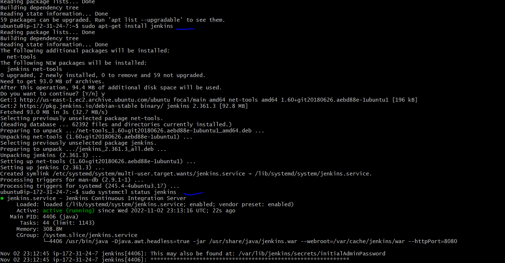
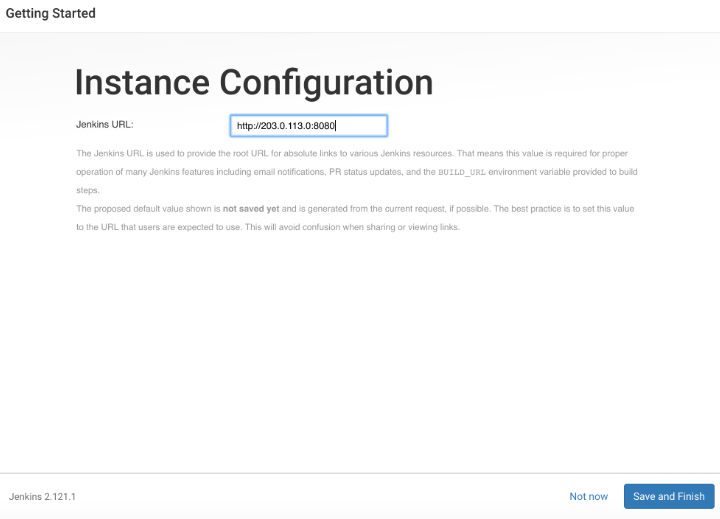
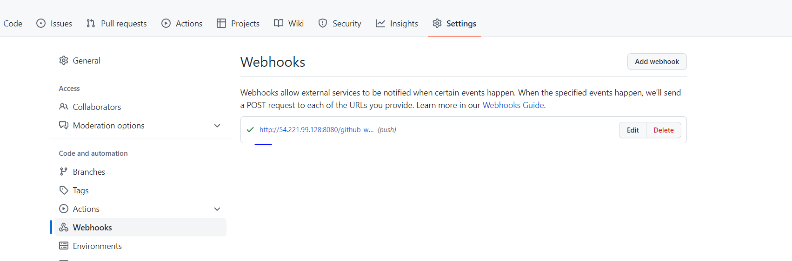

## **TOOLING WEBSITE DEPLOYMENT AUTOMATION WITH CONTINUOUS INTEGRATION**

### While considering the [Load balancer project](https//lbproject.com), If it is just two or three servers – it is not a big deal to configure them manually. Imagine that you would need to repeat the same task over and over again adding dozens or even hundreds of servers. DevOps is about Agility, and speedy release of software and web solutions. One of the ways to guarantee fast and repeatable deployments is Automation of routine tasks.
### Jenkins is one of the mostl popular CI/CD tools. Continuous integration (CI) is a software development strategy that increases the speed of development while ensuring the quality of the code that teams deploy. Developers continually commit code in small increments (at least daily, or even several times a day), which is then automatically built and tested before it is merged with the shared repository. Will utilize Jenkins CI capabilities to make sure that every change made to the source code in GitHub https://github.com/<yourname>/tooling will be automatically be updated to the Tooling Website.

### The goal is to enhance the architecture prepared in [Load_Balancer_Apache project](https://lbproject.com) by adding a Jenkins server, configure a job to automatically deploy source codes changes from Git to NFS server.

### **INSTALL AND CONFIGURE JENKINS SERVER**

*Create an AWS EC2 server based on Ubuntu Server 20.04 LTS and give it a prefered name*

*Update and upgrade ubuntu server with below command respectively;*

* `sudo apt update`

* `sudo apt upgrade`

*Install JDK (since Jenkins is a Java-based application);*

* `sudo apt install default-jdk-headless -y`

*Install Jenkins;*

* `wget -p -O - https://pkg.jenkins.io/debian/jenkins.io.key | sudo apt-key add -`

* `sudo sh -c 'echo deb http://pkg.jenkins.io/debian-stable binary/ > /etc/apt/sources.list.d/jenkins.list'`

* `sudo apt update`

* `sudo apt install jenkins -y`

*Make sure Jenkins is up and running;*

* `sudo systemctl status jenkins`

*By default Jenkins server uses TCP port 8080 – open it by creating a new Inbound Rule in your EC2 Security Group. In this case, AWS was used.*

*From your browser access `http://<Jenkins-Server-Public-IP-Address-or-Public-DNS-Name>:8080` You will be prompted to provide a default admin password*

*In the terminal window, use the `cat` command to display the password:*

* `sudo cat /var/lib/jenkins/secrets/initialAdminPassword`

*Copy the 32-character alphanumeric password from the terminal and paste it into the Administrator password field, then click Continue. The next screen presents the option of installing suggested plugins or selecting specific plugins:*

*You can then click the Install suggested plugins option, which will immediately begin the installation process.*

*You will be prompted to set up the first administrative user on completion of the installtion. It’s possible to skip this step and continue as admin using the initial password we used above, however in this case, took a moment to create the user.*

***Note:** The default Jenkins server is NOT encrypted, so the data submitted with this form is not protected. Refer to How to Configure Jenkins with SSL Using an Nginx Reverse Proxy on Ubuntu 20.04 to protect user credentials and information about builds that are transmitted via the web interface.*

*Enter the name and password for your user:*

*An Instance Configuration page will ask you to confirm the preferred URL for your Jenkins instance. Confirm either the domain name for your server or your server’s IP address;*

*After confirming the appropriate information, click Save and Finish. You’ll receive a confirmation page confirming that “Jenkins is Ready!”. Click Start using Jenkins to visit the main Jenkins dashboard*

### **Configure Jenkins to retrieve source codes from GitHub using Webhooks**

*Go to Jenkins web console, click "New Item" and create a "Test project"*

*Enable webhooks in your GitHub repository settings*

*This job will will be triggered by GitHub webhooks and will execute a ‘build’ task to retrieve codes from GitHub and store it locally on Jenkins server.*

*In configuration of your Jenkins Test project choose Git repository, provide there the link to your Tooling GitHub repository and credentials (user/password) so Jenkins could access files in the repository.*

*Save the configuration and let us try to run the build. For now we can only do it manually.*

*Click "Build Now" button, if everything is configured correctly, the build will be successfull and you will see it under #1. You can open the build and check in "Console Output" if it has run successfully;*

*Click "Configure" your job/project and add these two configurations. Configure triggering the job from GitHub webhook:*

*Configure "Post-build Actions" to archive all the files – files resulted from a build are called "artifacts".*

*Now, go ahead and make some change in any file in your GitHub repository (e.g. README.MD file) and push the changes to the master branch. You will see that a new build has been launched automatically (by webhook) and you can see its results – artifacts, saved on Jenkins server. We have now configured an automated Jenkins job that receives files from GitHub by webhook trigger (this method is considered as ‘push’ because the changes are being ‘pushed’ and files transfer is initiated by GitHub). There are also other methods: trigger one job (downstreadm) from another (upstream), poll GitHub periodically and others. By default, the artifacts are stored on Jenkins server locally `ls /var/lib/jenkins/jobs/tooling_github/builds/<build_number>/archive/`*
### **Configure Jenkins to copy files to NFS server via SSH**

*Artifacts are saved locally on Jenkins server, the next step is to copy them to our NFS server to /mnt/apps directory.Jenkins is a highly extendable application and there are 1400+ plugins available. A plugin that is called "Publish Over SSH" will be use.*

* Install "Publish Over SSH" plugin

*On main dashboard select "Manage Jenkins" and choose "Manage Plugins" menu item. On "Available" tab search for "Publish Over SSH" plugin and install it.*

* Configure the job/project to copy artifacts over to NFS server.

*On main dashboard select "Manage Jenkins" and choose "Configure System" menu item. Scroll down to Publish over SSH plugin configuration section and configure it to be able to connect to your NFS server:*

* Provide a private key (content of .pem file that you use to connect to NFS server via SSH/Putty) 
* Arbitrary name
* Hostname – can be private IP address of your NFS server
* Username – ec2-user (since NFS server is based on EC2 with RHEL 8)
* Remote directory – /mnt/apps since our Web Servers use it as a mointing point to retrieve files from the NFS server.

*Test the configuration and make sure the connection returns Success. Remember, that TCP port 22 on NFS server must be open to receive SSH connections.*

*Save the configuration, open your Jenkins job/project configuration page and add another one "Post-build Action"*

*Configure it to send all files probuced by the build into our previouslys define remote directory. In our case we want to copy all files and directories – so we use **.*

*To make sure that the files in `/mnt/apps` have been udated – connect via SSH/Putty to your NFS server and check README.MD file `cat /mnt/apps/README.md`*

*Change owner of the /mnt directory as it belongs to root;*

* `sudo chown -R nobody:nobody /mnt`

* `sudo chmod -R 777 /mnt`

*The run the `build now` again;*

*Check the console output for the log of the build. Webhook will trigger a new job and in the "Console Output" of the job you will find something like this;*

*To make sure that the files in `/mnt/apps` have been udated – connect via SSH/Putty to your NFS server and check README.MD file `cat /mnt/apps/README.md` If you see the changes you had previously made in your GitHub – the job works as expected.*

* `cd /mnt/apps`

`cat /mnt/apps/README.md`

*Market point on screen shot shows the update to the file;*

